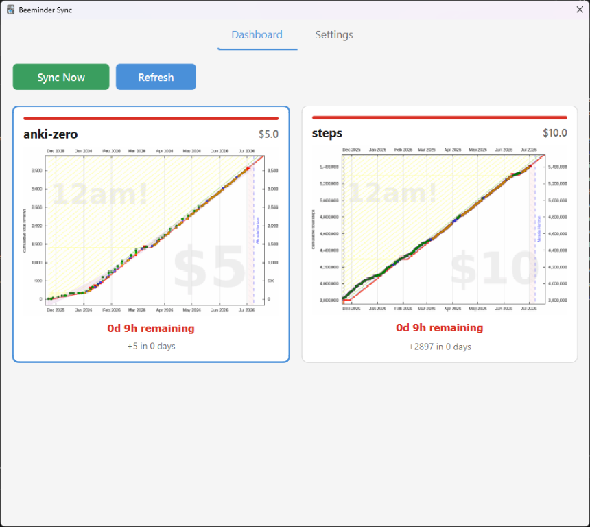
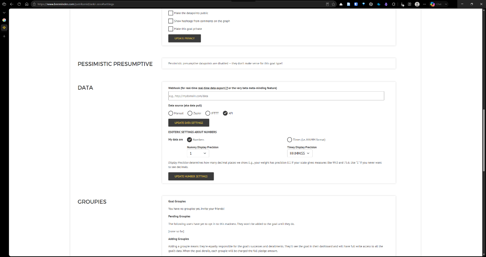

# Anki-Beeminder Sync

An Anki add-on that connects your daily study habit to Beeminder's commitment contract system. Every time you review cards, your progress is automatically reported to a Beeminder goal — putting real financial stakes behind the habit of opening Anki.

Built for people who know they should study but keep finding reasons not to.

---

## What this does

Anki is one of the most effective tools for long-term learning. Beeminder is an accountability platform that charges you money when you miss a commitment. This plugin bridges the two: it watches your Anki activity and keeps your Beeminder goal updated automatically, so you cannot coast, forget, or quietly fall behind without consequences.

You set the goal, set the stakes, and then just use Anki normally. The plugin handles the rest.

## How it works

After each review session or configured Anki sync, the plugin reads your chosen metric from Anki's database and posts it to your Beeminder goal via the Beeminder REST API. It uses a fixed daily idempotency key (`requestid`) so that multiple syncs on the same day update the same datapoint rather than stacking new ones. The value cache ensures the API is only hit when your count actually changes.

## Features

- **Four sync metrics** — pick what to track:
  - Total reviews today (all cards studied, including re-reviews)
  - New cards learned today (first-time introductions only)
  - Current backlog (cards due or in learning — for inbox-zero style goals)
  - Study time today (total minutes in review)
- **Deck filter** — track your whole collection or a single deck
- **Auto-sync** — fires after each review session and after configured sync, independently configurable
- **Deduplication** — one datapoint per day, updated in place, never stacked
- **Toolbar badge** — shows your current metric and remaining backlog at a glance
- **Dashboard** — live Beeminder graphs, time to derailment, and pledge amounts for all your goals
- **Background networking** — all API calls run off the main thread; Anki never freezes
- **Structured logging** — writes to `beeminder_sync.log` in the add-on folder for easy debugging

## Screenshots

### Toolbar badge in Anki

Shows your tracked metric and remaining backlog in one compact line.



### Beeminder goal setup (data source = API)

Set your Beeminder goal data source to API so updates are driven by the plugin.



## Requirements

- Anki 2.1.50 or later
- A Beeminder account (free tier is sufficient)
- No external Python dependencies — uses the standard library only

The Linux worker installs the pinned headless Anki dependency from
`requirements-worker.txt` into its own virtual environment. It is not installed
into the desktop add-on.

## Installation

### Via AnkiWeb

Search for **Anki-Beeminder Sync** in Anki's add-on browser under Tools > Add-ons > Get Add-ons, or use the add-on code from the AnkiWeb listing.

### Manual installation

1. Download the latest release from the [Releases page](../../releases).
2. Extract the archive. You should have a folder named `anki_beeminder_sync`.
3. Copy that folder into your Anki add-ons directory:
   - **Windows:** `%APPDATA%\Anki2\addons21\`
   - **macOS:** `~/Library/Application Support/Anki2/addons21/`
   - **Linux:** `~/.local/share/Anki2/addons21/`
4. Restart Anki.

## Setup

### Step 1 — Get your Beeminder API token

While logged into Beeminder, open this URL in your browser:

```
https://www.beeminder.com/api/v1/auth_token.json
```

Copy the value of `token`.

### Step 2 — Create a Beeminder goal

Create a goal that matches the metric you want to track.

**For review counts or study time** — use a "Do More" goal:
- Goal type: Do More
- Units: reviews, cards, or minutes
- Rate: a daily minimum that is achievable but not trivial

**For backlog** — use an "Inbox Fewer" goal:
- Goal type: Inbox Fewer (or Do Less)
- Target: the maximum backlog you are willing to tolerate
- Rate: a downward slope that keeps you honest

Note the goal's **slug** — the final segment of its URL: `beeminder.com/you/THIS-SLUG`.

### Step 3 — Set the goal's data source to API

In your goal's settings on the Beeminder website, find the Data section and select **API** as the data source. This marks the goal as automation-driven and discourages casual manual entry. Since the plugin uses a fixed daily `requestid`, the plugin's datapoint will always reflect your actual Anki activity for that day.

### Step 4 — Configure the plugin

Click the badge in the Anki toolbar (or go to Tools > Beeminder Sync) and open the **Settings** tab:

| Field | Description |
|---|---|
| Username | Your Beeminder username |
| API Token | The token from step 1 |
| Goal Slug | The slug from step 2 |
| Metric | Which Anki stat to report |
| Deck Filter | Leave blank for all decks, or select one |
| Other Goals | Additional goal slugs to display on the dashboard |
| Auto-Sync Triggers | Choose when the plugin fires automatically |

Click **Save Settings**. The toolbar badge updates immediately.

## Usage

**Automatic:** Study as normal. The plugin syncs when you finish a review session or when Anki syncs with the configured sync server.

**Manual:** Click the toolbar badge or go to Tools > Beeminder Force Sync to push an update immediately.

**Dashboard:** Click the toolbar badge and stay on the Dashboard tab to see live graphs, time to derailment, and pledge amounts for all configured goals.

## Linux self-hosted daily sync

The daily worker is intentionally local now. GitHub-hosted runners cannot
reliably download a full collection from AnkiWeb headlessly, so the supported
path is:

```text
AnkiMobile ─┐
Desktop Anki ─┼─> Linux self-hosted sync server
             │              │
             │              └─> 21:05 systemd worker ─> Beeminder
```

The server is the official standalone Anki sync server described in the
[Anki Manual](https://docs.ankiweb.net/sync-server.html). The repository pins
the same `anki==26.5` package for the server and the worker. Keep the server
and Anki clients on compatible versions; Anki's sync protocol can change.

### Install the Linux setup

Check out this repository on the Linux machine that should stay available for
mobile sync, then run:

```bash
bash scripts/setup_linux_sync.sh
```

The wizard installs the Python runtime, creates an unprivileged `anki` service
account, configures these systemd units, and asks for credentials without
printing them:

- `/etc/systemd/system/anki-sync-server.service`
- `/etc/systemd/system/anki-beeminder.service`
- `/etc/systemd/system/anki-beeminder.timer`

Secrets are stored outside Git in:

- `/etc/anki-beeminder/anki-sync-server.env`
- `/etc/anki-beeminder/anki-beeminder.env`

The server collection lives at
`/var/lib/anki-beeminder/sync/collection.anki2`. The worker first creates a
SQLite snapshot of that file, then counts `revlog` entries in the snapshot, so
it does not open the live server database for metric queries.

### Safe migration from AnkiWeb

1. Sync desktop Anki with AnkiWeb and create a fresh backup/export.
2. Run the Linux wizard.
3. In desktop Anki's syncing preferences, select the self-hosted sync server
   and enter a URL such as `http://192.168.1.20:8080/` (keep the trailing `/`).
4. Enter the new local sync username/password. On the first sync, explicitly
   choose **Upload to server** so the backed-up desktop collection becomes the
   Linux server copy.
5. Configure AnkiMobile with the same URL and credentials, then sync it.
6. Run the worker in dry-run mode and inspect the result before allowing the
   first real Beeminder update:

```bash
  cd /opt/anki-beeminder
  sudo -u anki env \
  ANKI_COLLECTION_PATH=/var/lib/anki-beeminder/sync/collection.anki2 \
  ANKI_TIMEZONE=Europe/Ljubljana \
  BEEMINDER_USER='your-user' \
  BEEMINDER_TOKEN='your-token' \
  BEEMINDER_GOAL='your-goal' \
  /opt/anki-beeminder/venv/bin/python -m scripts.daily_beeminder_sync --dry-run
```

Do not guess if the first-sync direction is unexpected; restore the backup
and retry the cutover. The Linux host must be running and reachable whenever
AnkiMobile needs to sync. For access away from home, use a private VPN such as
Tailscale or a properly configured HTTPS reverse proxy. Do not expose the
server's plain HTTP port directly to the public internet.

### Operations

The timer uses the Linux host's local timezone and runs at 21:05. Set it
explicitly if needed:

```bash
sudo timedatectl set-timezone Europe/Ljubljana
sudo systemctl status anki-sync-server.service --no-pager
sudo systemctl list-timers anki-beeminder.timer
sudo journalctl -u anki-sync-server -u anki-beeminder --since today
```

To run a real manual update after confirming the dry-run:

```bash
sudo systemctl start anki-beeminder.service
```

The worker uses a fixed daily Beeminder `requestid`, so rerunning the timer
updates the same datapoint rather than creating duplicates. It reports only
reviews that have already synced to the Linux server; the metric counts review
answers (`revlog` entries), not unique notes.

## Metrics reference

### Total reviews today

Counts every entry in Anki's review log (`revlog`) since the start of the current Anki day (your configured day cutoff, typically 4 AM local time). Includes re-reviews of mature cards, learning steps, and new cards. Best paired with a "Do More" goal.

### New cards learned today

Counts only `revlog` entries with `type = 0` — cards introduced for the first time today. Use this if you want to track how aggressively you are expanding your deck rather than maintaining it.

### Current backlog

Counts cards matching `is:due or is:learn` at the moment of sync. This number decreases as you review. Best paired with a Beeminder "Inbox Fewer" goal where derailment occurs if your backlog exceeds a set ceiling.

### Study time today

Sums the `time` column in today's `revlog` (stored in milliseconds) and converts to minutes. Useful if you prefer time-based commitments over card-count commitments.

## Troubleshooting

| Symptom | Likely cause | Fix |
|---|---|---|
| Badge shows 0 after studying | Metric is set to backlog (decreases as you study) | Switch to "Total reviews today" in Settings |
| "Authentication failed" dialog | API token is wrong or expired | Re-fetch from `beeminder.com/api/v1/auth_token.json` |
| "Goal not found" dialog | Slug is mistyped or goal was archived | Check the slug in your Beeminder goal URL |
| No sync after reviewing | Auto-sync trigger is off, or debounce active | Check Settings; wait 60s between rapid sessions |
| Dashboard graphs not loading | Network issue | Click Refresh; images load in the background |

For detailed diagnostics, open `beeminder_sync.log` inside the add-on folder (`addons21/anki_beeminder_sync/`). It records every sync attempt, value sent, API response, and any errors.

## Contributing

Bug reports and pull requests are welcome. Please open an issue before submitting a large change.

## License

MIT. See [LICENSE](LICENSE).
